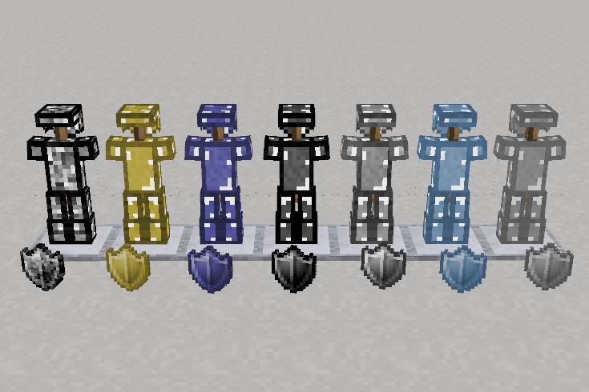

minetest mod 3d_armor_technic
============================

ARMOR from procesed materials

Information
-----------

Adds armor made from lead, brass, cast iron, carbon steel, stainless steel, tin and silver.

Technical information
---------------------

This mod is named `3d_armor_technic` and is(was) part of the `3d_armor`, 
it was slited since version 0.4.11 of `3d_armor` now in minenux flavor merged again

Currently the mod was updated at https://git.minetest.io/minenux/minetest-mod-3d_armor_technic 
but this one already track the updates and also permits to work with 
any engine version since 0.4.16+ to 5.X

This mod was integrated back to minenux's 3d_armor as commit `b740914f3958770cd46b8645b65c21b8f2c34d2e`
* https://github.com/minenux/minetest-mod-3d_armor
* https://codeberg.org/minenux/minetest-mod-3d_armor
* https://gitlab.com/minenux/minetest-mod-3d_armor

#### Depends

* default
* 3d_armor
* technic (technic_worldgen)
* moreores

## LICENSE

Textures

* Copyright  @poet-nohit and @numberZero

Source code and features

* Copyright (C) 2023-2024 PICCORO Lenz Mckay @mckaygerhard - LGPL v2.1
* Copyright (C) 2013-2018 Stuart Jones - LGPL v2.1

